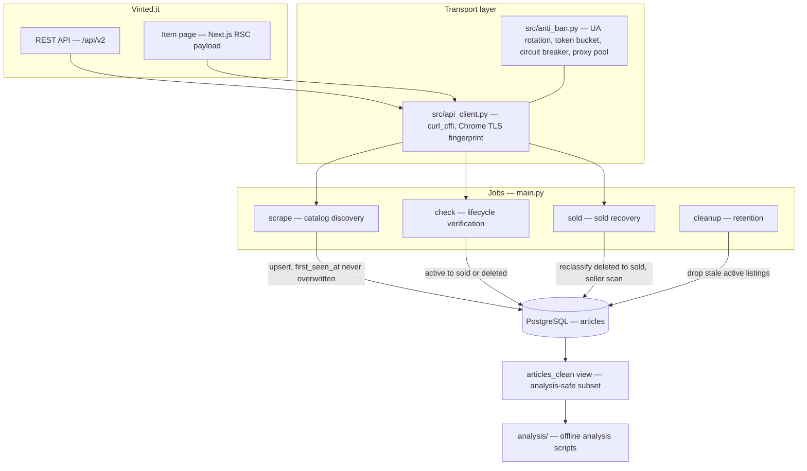

# Vinted Scraper

[](https://github.com/ivanboffa/vinted-scraper/actions/workflows/tests.yml)
[](LICENSE)

A production-grade data pipeline that tracked the **full lifecycle of second-hand
clothing listings** on [vinted.it](https://www.vinted.it) — from the moment an item
appeared in the catalog to the moment it sold or was withdrawn — in order to answer
a question the platform never exposes: *what actually makes an item sell?*

Roughly 200k listings were tracked across 27 women's and men's categories, with
per-item resolution of price, brand, size, condition, seller reputation, engagement
counters, and time-to-sale.

> **Status: archived.** The project ran continuously for several months. The Supabase
> database behind it has since been deleted, so the scheduled workflows in
> [`.github/workflows/`](.github/workflows/) are intentionally left dormant — they
> would fail without a `DATABASE_URL`. The code is preserved here as an engineering
> record.

---

## Why it is not trivial

Vinted actively defends against automated traffic, and a listing's *sold* state is
deliberately hard to observe. Most of the engineering effort went into those two
problems rather than into the scraping loop itself.

**TLS-level bot detection.** Sending well-formed HTTP headers is not enough: Cloudflare
and DataDome fingerprint the TLS handshake itself (JA3/JA4), and any stock Python HTTP
client is identifiable before a single byte of the request is read. The client uses
[`curl_cffi`](https://github.com/lexiforest/curl_cffi) to impersonate Chrome 136 at the
handshake level, with the user-agent pool in
[`src/anti_ban.py`](src/anti_ban.py) kept deliberately in sync with the impersonated
version — a mismatch between the TLS fingerprint and the advertised UA is itself a
detection signal. The `X-Requested-With` header is omitted for the same reason: real
Chrome `fetch()` does not send it.

**Sold-state detection across a framework migration.** Mid-project, Vinted migrated
its item pages from the Next.js Pages Router to the App Router. The item state stopped
living in a parseable `__NEXT_DATA__` script tag and moved into React Server Component
chunks — `self.__next_f.push([1, "…"])` — where the JSON arrives as an *escaped* JS
string, so `\"is_closed\":true` rather than `"is_closed":true`. Sold detection broke
silently: items were still being resolved, just misclassified. The parser in
[`src/api_client.py`](src/api_client.py) now falls through four strategies in order —
RSC chunks, legacy `__NEXT_DATA__`, raw regex over the HTML, and finally Italian
visible-text indicators — so a future migration degrades instead of failing.

**Distinguishing *sold* from *deleted*.** A `404` means the listing is gone; it does not
say why, and the difference is the entire point of the dataset. Resolution combines
`is_sold`, `is_closed`, `item_closing_action`, `status`, and `can_buy`, since no single
field is authoritative across API versions — see `_parse_sold_status` in
[`src/status_checker.py`](src/status_checker.py). Items that a first-pass `404` had
already written off as deleted are re-examined later by the sold finder.

**Keeping the dataset honest.** Listings discovered *already* sold carry no observable
time-to-sale and would inflate any sell-through rate computed over them. They are
flagged `sourced_as_sold` on insert. Items collected before the RSC detection fix are
flagged `detection_era = 'pre_fix'`. The `articles_clean` view excludes both, so
analysis runs on items whose full active-to-sold transition was genuinely observed.

---

## Architecture



### The four jobs

All four are entry points of [`main.py`](main.py) and share one connection pool and one
HTTP client.

| Mode | What it does |
|---|---|
| `scrape` | Walks every non-excluded category, paginating the catalog API, and upserts what it finds. Items the catalog already reports as sold take a separate insert path so they are recorded without polluting sell-rate statistics. |
| `check` | Re-verifies listings the database still believes are active and resolves each into `sold`, `deleted`, or still `active`. Work is bucketed by age — fresh items sell fastest and are checked most aggressively. |
| `sold` | Two recovery strategies: re-examine everything previously marked `deleted` to catch pre-fix misclassifications, and scan the profiles of known sellers for sold items never seen in the catalog at all. |
| `cleanup` | Applies the retention policy, dropping still-active listings past `RETENTION_DAYS`. |

The same jobs run under two deployment models: as discrete scheduled
[GitHub Actions workflows](.github/workflows/), or as a single long-lived worker via
[`src/scheduler.py`](src/scheduler.py), which holds a mutex so jobs never overlap and
backs off for 30 minutes after an unhandled exception.

### Modules

| File | Responsibility |
|---|---|
| [`src/api_client.py`](src/api_client.py) | HTTP client, TLS impersonation, session and CSRF handling, RSC/HTML parsing |
| [`src/anti_ban.py`](src/anti_ban.py) | User-agent rotation, jittered delays, token-bucket rate limiting, circuit breaker, proxy rotation |
| [`src/async_scraper.py`](src/async_scraper.py) | Concurrent catalog traversal with a batching database writer |
| [`src/status_checker.py`](src/status_checker.py) | Lifecycle resolution and age-bucketed prioritisation |
| [`src/sold_finder.py`](src/sold_finder.py) | Deleted-to-sold reclassification and seller-profile scanning |
| [`src/db_manager.py`](src/db_manager.py) | Schema, idempotent migrations, upsert logic, async pool |
| [`src/categories.py`](src/categories.py) | Category discovery, 7-day cache, verified fallback list |
| [`src/scheduler.py`](src/scheduler.py) | Long-running worker loop with signal handling |

### Data model

A single `articles` table in PostgreSQL, defined in
[`src/db_manager.py`](src/db_manager.py). The invariant that makes the dataset usable is
in the upsert: a re-scrape refreshes mutable fields and `last_seen_at`, but
`first_seen_at`, `sold_at`, and `status` are **never** overwritten by the scraper. Only
the status checker may declare an item sold. Without that rule, every re-scrape would
reset the clock and time-to-sale would be unrecoverable.

Schema changes ship as idempotent `ADD COLUMN IF NOT EXISTS` migrations that run on
every connect, so a redeploy never requires a manual migration step.

---

## Project layout

```
main.py            CLI entry point — scrape | check | sold | cleanup | scheduler
config.py          environment-driven configuration
src/               pipeline modules
analysis/          offline analysis over the collected dataset
scripts/           one-off operational runners
tests/             offline test suite
.github/workflows/ test workflow, plus the archived pipeline jobs
```

## Running it

The pipeline needs a PostgreSQL database. The original one no longer exists, so a fresh
instance is required to run this today; the schema is created automatically on first
connect.

```bash
pip install -r requirements.txt
cp .env.example .env          # then fill in DATABASE_URL

python -u main.py scrape      # one discovery pass
python -u main.py check       # one lifecycle-verification pass
python -u main.py sold        # sold recovery
python -u main.py cleanup     # retention
python -u main.py scheduler   # continuous worker
```

Configuration is entirely environment-driven — every knob is listed in
[`.env.example`](.env.example) and read in [`config.py`](config.py). Optional HTTP
proxies go one per line in [`proxies.txt`](proxies.txt); the pool self-heals, evicting
proxies that fail.

Containerised deployment uses the [`Dockerfile`](Dockerfile), with
[`koyeb.yaml`](koyeb.yaml) describing the worker service as originally deployed.

### Analysis and operational scripts

| Script | Purpose |
|---|---|
| [`analysis/sales_overview.py`](analysis/sales_overview.py) | Sold-vs-active comparison across price, brand, category, condition, and engagement |
| [`analysis/sales_deep_dive.py`](analysis/sales_deep_dive.py) | Price × category matrix, size sell rates, seller buckets, title keywords |
| [`scripts/bulk_status_check.py`](scripts/bulk_status_check.py) | Many consecutive check cycles, to maximise sold detection in one sitting |
| [`scripts/grow_corpus.py`](scripts/grow_corpus.py) | Scrape-and-check loop to a target corpus size, pausing when the API blocks |
| [`scripts/run_full_cycle.py`](scripts/run_full_cycle.py) | Full cycle: scrape, then dual newest-plus-oldest verification pass |

### Tests

```bash
pip install -r requirements-dev.txt
pytest
```

The suite in [`tests/`](tests/) runs offline — no database, no network. It covers the
parts where a silent mistake would corrupt the dataset rather than raise: lifecycle
precedence in `_parse_sold_status`, sold detection across both Next.js eras, catalog
normalisation edge cases, category filtering, and the rate-limiter and circuit-breaker
behaviour.

---

## Tech stack

Python 3.11 · asyncio · asyncpg · PostgreSQL · curl_cffi · Docker · GitHub Actions · Koyeb

## Notes

Built for personal research on a public catalog. Requests are rate-limited, jittered,
and circuit-broken to stay well below any load a normal browsing session would generate.

## License

[MIT](LICENSE)
